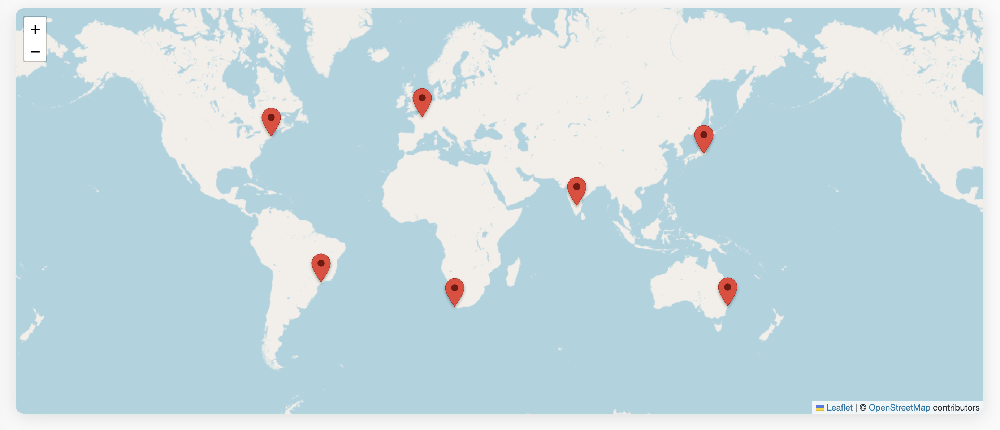

# granite-worldmap

A [Lit](https://lit.dev) web component that renders an interactive world map
(Leaflet + OpenStreetMap) with a marker for every location in its `locations`
property — in the spirit of the speaker maps shown on [Noti.st](https://noti.st)
profiles, but with no API key and no billing account required.



## Install

Published on npm as [`@granite-elements/granite-worldmap`](https://www.npmjs.com/package/@granite-elements/granite-worldmap):

```bash
npm install @granite-elements/granite-worldmap
```

## Usage

```html
<script type="module">
  import '@granite-elements/granite-worldmap/granite-worldmap.js';
</script>

<granite-worldmap id="map"></granite-worldmap>

<script type="module">
  document.querySelector('#map').locations = [
    { name: 'Paris', lat: 48.8566, lng: 2.3522, url: '/talks/paris' },
    { name: 'Tokyo', lat: 35.6762, lng: 139.6503 },
    { name: 'Boston', lat: 42.3601, lng: -71.0589 },
  ];
</script>
```

`locations` is an array of objects. Only `lat` and `lng` are required:

| Field  | Type   | Required | Description                                   |
| ------ | ------ | -------- | --------------------------------------------- |
| `lat`  | Number | yes      | Latitude                                      |
| `lng`  | Number | yes      | Longitude                                     |
| `name` | String | no       | Shown in the marker popup and as hover title  |
| `url`  | String | no       | When present, shown as a link inside the popup |

> Coordinates are required because Leaflet positions markers by lat/lng. If you
> only have place names, geocode them first (e.g. via OpenStreetMap's Nominatim)
> and feed the resulting coordinates in.

## Properties / attributes

| Property         | Attribute          | Type    | Default                          | Description                                          |
| ---------------- | ------------------ | ------- | -------------------------------- | ---------------------------------------------------- |
| `locations`      | —                  | Array   | `[]`                             | Locations to mark                                    |
| `zoom`           | `zoom`             | Number  | `2`                              | Initial zoom (overridden by `fitMarkers`)            |
| `center`         | —                  | Array   | `[20, 0]`                        | Initial `[lat, lng]` center                          |
| `tileUrl`        | `tile-url`         | String  | OpenStreetMap tiles              | Tile layer URL template                              |
| `attribution`    | `attribution`      | String  | OpenStreetMap attribution        | Tile attribution HTML                                |
| `fitMarkers`     | `fit-markers`      | Boolean | `true`                           | Fit the viewport to the markers' bounds              |
| `leafletCssUrl`  | `leaflet-css-url`  | String  | unpkg Leaflet CSS                | Stylesheet injected into the shadow root (see below) |

## Events

`granite-worldmap-marker-click` — fired when a marker is clicked. `event.detail`
is the matching location object.

```js
map.addEventListener('granite-worldmap-marker-click', e => {
  console.log(e.detail.name);
});
```

## Styling

The component is themeable through CSS custom properties:

| Custom property                          | Default   | Description                |
| ---------------------------------------- | --------- | ------------------------- |
| `--granite-worldmap-height`              | `400px`   | Map height                |
| `--granite-worldmap-bg`                  | `#aad3df` | Background behind tiles   |
| `--granite-worldmap-border-radius`       | `0`       | Map border radius         |
| `--granite-worldmap-marker-color`        | `#ea4335` | Pin fill                  |
| `--granite-worldmap-marker-border-color` | `#b31412` | Pin outline               |
| `--granite-worldmap-marker-hole-color`   | `#7a0e08` | Pin center hole           |

## A note on Leaflet + Shadow DOM

Two things make Leaflet behave inside a web component's shadow root, and this
component handles both for you:

1. **Stylesheet injection.** Leaflet's CSS, normally added to `<head>`, does not
   cross the shadow boundary. The component injects a `<link>` to the Leaflet
   stylesheet inside its shadow root (configurable via `leaflet-css-url`).
2. **SVG pin markers.** Instead of Leaflet's default image-based markers (whose
   image paths frequently break under bundlers and shadow DOM), markers are
   rendered as Google-Maps-style `L.divIcon` SVG pins styled with the CSS custom
   properties above.

## Development

```bash
npm install
npm start        # serves the demo at /demo/ with live reload
npm test         # web-test-runner
```

## License

MIT
